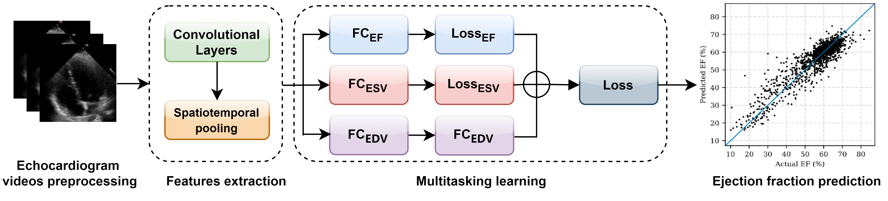

# MFCFA: Multi-task Framework for Cardiac Function Assessment

Code for the paper:

> **An AI-Based Multi-task Framework for Cardiac Function Assessment through Echocardiograms**
> Aoyang Guo et al., SPIE ICGIP 2023

## Overview

MFCFA predicts left ventricular ejection fraction (EF) from echocardiogram videos using a multi-task learning approach. The model simultaneously predicts EF, end-systolic volume (ESV), and end-diastolic volume (EDV) using a weighted loss:

```
Loss = 0.9 × Loss_EF + 0.09 × Loss_ESV + 0.01 × Loss_EDV
```



**Results on EchoNet-Dynamic test set:**

| Metric | Score |
|--------|-------|
| MAE    | 3.89% |
| RMSE   | 5.13  |
| R²     | 0.82  |

## Requirements

```bash
pip install -r requirements.txt
```

## Dataset

Download [EchoNet-Dynamic](https://echonet.github.io/dynamic/) and configure the data directory in `echonet.cfg`:

```
DATA_DIR = /path/to/EchoNet-Dynamic/
```

## Usage

**Train:**
```bash
python -m echonet video
```

**Train with custom options:**
```bash
python -m echonet video --data_dir /path/to/data --num_epochs 45 --batch_size 15
```

**Key options:**

| Option | Default | Description |
|--------|---------|-------------|
| `--data_dir` | from cfg | Path to EchoNet-Dynamic dataset |
| `--output` | `output/video/` | Output directory |
| `--num_epochs` | 45 | Number of training epochs |
| `--batch_size` | 15 | Batch size |
| `--model_name` | `r2plus1d_18` | Backbone model |
| `--pretrained` | True | Use Kinetics-400 pretrained weights |

## Project Structure

```
├── echonet/
│   ├── datasets/
│   │   └── echo.py       # EchoNet-Dynamic dataset loader
│   └── utils/
│       └── video.py      # Training and evaluation (MFCFA multi-task loss)
├── requirements.txt
└── LICENSE
```

## Acknowledgements

This project builds on [EchoNet-Dynamic](https://github.com/echonet/dynamic) (Ouyang et al., Nature 2020). The dataset loader and training pipeline are adapted from their open-source codebase.
